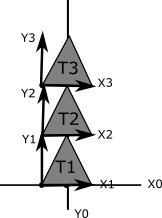

include::header.adoc[]

:title: Quiz 1: Study Guide
:Author Initials: ASN
:Date:    2021-08-26
:Revision: 0.1

= {title}

Quizzes are open book. 30 minutes at the start of class

Topics:

* C++:
** `float`, `char`, `std::string`, `int`
** pass by value, pass by reference 
** `std::vector`
** `struct`, `class`
* points and vectors
* coordinate systems

= Practice questions: C++

1) What is the value of x for the following expressions? Assume x has the correct 
type for the expression and that the following variables are defined.

[source]
----
std::string hello = "hello";
int a = 10;
int b = 45;
float c = -1.0;
----

* `x = a/10;`
* `x = a/3;`
* `x = c+4.1;`
* `x = asin(c);`
* `x = cos(0);`
* `x = hello + " friends";`
* `x = asin(a)`
* `x = b * M_PI/180`

2) Consider the following program. Does it compile? If no, say why.
If yes, what is its output?
What is its output? (Note: the formatting for printing to vector should assume
that the x, y, z components are printed in order)

[source]
----
#include <iostream>
#include "atk/aglm.h"

void foo(glm::vec3& p)
{
    p[1] = 10;
    std::cout << p << std::endl;
}

int main(int argc, char** argv)
{
    glm::vec3 p(0,0,0);
    foo(p);
    std::cout << p << std::endl;
}
----

3) Consider the following program. Does it compile? If no, say why. 
If yes, what is its output?
What is its output? (Note: the formatting for printing to vector should assume
that the x, y, z components are printed in order)

[source]
----
#include <iostream>
#include "atk/aglm.h"

void foo(const glm::vec3& p)
{
    p[1] += 10;
    std::cout << p << std::endl;
}

int main(int argc, char** argv)
{
   glm::vec3 p(0,0,0);
   foo(p);
   std::cout << p << std::endl;
}
----

4) Consider the following program. Does it compile? If no, say why. 
If yes, what is its output?
What is its output? (Note: the formatting for printing to vector should assume
that the x, y, z components are printed in order)

[source]
----
#include <iostream>
#include "atk/aglm.h"

void foo(const glm::vec3& p)
{
    std::cout << p + glm::vec3(0,10,0) << std::endl;
}

int main(int argc, char** argv)
{
   foo(glm::vec3(0,0,0));
}
----

5) Consider the following program. Does it compile? If no, say why. 
If yes, what is its output?
What is its output? (Note: the formatting for printing to vector should assume
that the x, y, z components are printed in order)

[source]
----
#include <iostream>
#include "atk/aglm.h"

void foo(glm::vec3 p)
{
   p[1] += 10;
   std::cout << p << std::endl;
}

int main(int argc, char** argv)
{
   glm::vec3 p(0,0,0);
   foo(p);
   std::cout << p << std::endl;
}
----

6) Consider the following program. Does it compile? If no, say why. 
If yes, what is its output?
What is its output? (Note: the formatting for printing to vector should assume
that the x, y, z components are printed in order)

[source]
----
#include <iostream>

void foo(glm::vec3& p)
{
   std::cout << p + glm::vec3(0,10,0) << std::endl;
}

int main(int argc, char** argv)
{
   foo(glm::vec3(0,0,0));
}
----

7) Write a program that stores 3 points in a `std::vector`. Then iterate through the vector to print each instance out.

= Vector practice

1) Short answer

* What does NaN stand far? When can it occur?
* Suppose we have an angle X in degrees. Give an expression for converting it to radians.
* Suppose we have an angle X in radians. Give an expression for converting it to degrees.
* What is the origin?
* What is the difference between a avector and a point?
* What is a unit vector?
* What does it mean to normalize a vector? Why might we want to do this?
* Do the built-in functions for sin, cos, and tan in C++ take radians or degrees?
* What is the difference between atan and atan2? Which is better and why?

2) Suppose we wish to stack three triangles in a row as in the diagram below.
Let each triangle's base be 2 units wide and each triangle's height be 2 units high. 
The origin of each triangle is at the bottom left corner.

* What should the positions of each triangle be if we would like the centers of each triangle to be along the Y-axis?
* Write psuedocode to position N traingles along the Y axis.
* Suppose the bottom triangle is traveling with velocity (0,1,0)units per second. At what time will it be aligned with the top triangle?
* What should the positions of the triangles be if we wish to position each triangle 130 degrees apart in a circle 1 unit away from the origin?

3) Suppose we have a target at a point *g* and we wish to compute a point *p* between *g* and the origin. Derive an expression for *p* using atan2.

4) Suppose we have a particle at position (1,1). What is its distance from the origin? What is its distance from the x-axis? Its distance from the y-axis? What is the angle between the direction (1,1) and the positive x-axis? Angle from the negative x-axis? Angle from the positive y-axis?

5) Suppose we have two particles at position (1,1) and (-3,4). Draw them. How far apart are they from each other?

6) Suppose we have a vector v = (1,2,0)^T and u = (-2, 3, 0)^T. What is the value of u+v? Draw u, v, and u+v. Suppose we multiply v by -2. Compute and draw the result.

7) Suppose we have a vector v = (1,2,0)^T. What is its length? Give and expression and evaluate it. Write a program that defines v and prints its length. 
 
8) A particle travels with velocity (1,2,3) units per second. What is its speed? Where will the particle be after 3 seconds if it starts at position (-1,-2,3)? Suppose we wish to change the speed to 10 units per second. What would the new velocity be? Write a program that implements the movement of the particle p.

9) Suppose we have an animation that runs at 24 fps. What does this mean? How many frames do we display in a minute? How much time passes between each frame?

10) Suppose a character at position p = (1,5,0) is facing the direction fwd = (-1, -2, 0). Suppose the character's field of view (fov) is 60 degrees. If another character is at position a = (2,3,0), can p see a?  Is a on the left or right of p? How far apart are they?