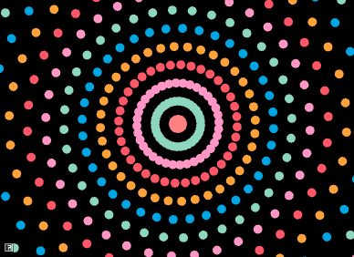
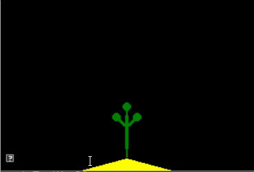

include::header.adoc[]

:title: Assignment 1: Hello Animation!
:Author Initials: ASN
:Date:    2020-02-07
:Revision: 0.1
:Dir: a1

= {title}

_In which, we make procedural 2D animations with spheres_

**Due Friday, September 17th, before midnight**

In this assignment, you will work with particles that move in straight lines,
circles, oscillations, or the direction of a target.

The goals of this lab are to work with

* points, velocity, and time
* sine, cosine, and tangent

:sectnums:

= Get the source

On Github, do a `Fetch Upstream` to synchronize your forked repository with the class repository.

Then update the source on your local machine and rebuild.

[source]
----
> git pull
> cd build
> cmake ..; make
----

= Question 1: Eyes!

An easy way to create smooth motion is to use sine() or cosine() to
change an object's properties. For this question, modify the code in
*assignments/a1-hello/eyes.cpp* to draw a pair of eyes. Then use sine()
or cosine() to animate the two eyes.

To run your program from the */build* directory, type 

[source]
----
build (mac/unix)> ../bin/a1-eyes
build (windows)> ../bin/Debug/a1-eyes
----

NOTE: sin() will smoothly vary between 1 and -1 given smoothly
increasing values. Use link:https://alinen.github.io/agl/html/reference.html#reftime[elapsedTime()] as the input
to sin().

image:Labs/eyes.gif[]

= Question 2: Look! 

In class, we talked about how atan2 (tangent) can be used to compute an angle 
given a point. For this question, you will animate the eyes from Question 1 to 
follow a target. Your solution should use tangent to compute the position of 
the pupils.

The target is indicated with a red dot. To move it, click and hold down
the left mouse button to drag it to a new location.

Implement your solution in *assignments/a1-hello/look.cpp*.
To run your program from the *build* directory, type 

[source]
----
build (mac/unix)> ../bin/a1-look
build (windows)> ../bin/Debug/a1-look
----

image:Labs/look.gif[]

= Question 3: Many particles!

In class, we talked about how to animate a particle to move in a 
straight line. In this assignment, we will
extend this program to animate *lots* of particles moving in a straight
line.

Implement your program in *assignments/a1-hello/particles.cpp* 
To run your program from the *build* directory, type 

[source]
----
build (mac/unix)> ../bin/a1-particles
build (windows)> ../bin/Debug/a1-particles
----

image:Labs/velocity.gif[]

This program should support the following features

* Create 100+ particles, randomly distributed across the screen
* Particles should all move in the same direction, but at different speeds
* Particles should wrap when they move off the screen. For example, if a particle's X position is greater than the window width, it should be reset to 0.
* Particle colors should also be randomized<

It is up to you how to implement your program. However, some recommendations

* Implement moving particles first
* Implement random colors afterwards
* Define a struct or class to hold the state for each particle. The state would include the particle's position, color, and velocity.
* Store your particles in a vector or array. Initialize them in setup(). Update and draw them in scene().

NOTE: *Color Jitter* The easiest way to generate a random color is to
sample a random value for each red, green, and blue component. However, in
the example above, we used a different approach called _color
jitter_. To jitter color, we start with a base color and then add
random deviations from it. For example, if our base color were blue, (0.2,0.8,0.2),
we can jitter its components by adding random values in the range [-0.2,
0.2]. This gives us colors that are close to the original but still has 
variety.

= Question 4: Hypnotic circles 

In class, we talked about how to animate a particle to move in a
circle. In this assignment, we will
extend this program to animate particles moving in concentric circles.

Implement your solution in *assignments/a1-hello/circles.cpp*
To run your program from the *build* directory, type 

[source]
----
build (mac/unix)> ../bin/a1-circles
build (windows)> ../bin/Debug/a1-circles
----

This program should satisfy the following requirements

* Create 36*N particles, where N is the number of concentric circles. Each circle should have 36 particles, spaced 10 degrees apart.
* Alternating circles should rotate in opposite directions.
* Particles in the same circle should share the same color.

NOTE: *Color Palettes* A color palette is a simple method for generating
harmonious colors. In this approach, we define a list of colors to use in our 
application. When we need a color, we choose it from this list. 
Above, we used the following palette.

[source]
----
   //https://www.color-hex.com/color-palette/82379
   std::vector<vec3> pallet = 
   {
      vec3(0,165,227)/255.0f,
      vec3(141,215,191)/255.0f,
      vec3(255,150,197)/255.0f,
      vec3(255,87,104)/255.0f,
      vec3(255,162,58)/255.0f
   };
----

= Question 5: Make your own animation

Use different shapes, colors, curves, scale, etc. to make your own demo

image:Labs/spiral.gif[height=100]

image:Labs/transformEx-bookofshaders.gif[height=100]

Implement your unique animation in the file `assignments/a1-hello/unique.cpp`

Some ideas

* Animate color and size
* Change the color based on the current position
* Create an interesting scene
* Use more interesting velocities and curves for the particles, for example
** Try to create falling snow or rising bubbles
** Create a spiral animation
** Try link:https://en.wikipedia.org/wiki/Rose_(mathematics)[rose curves]
** Try link:https://en.wikipedia.org/wiki/Spirograph[Spirograph]

include::handin.adoc[]
