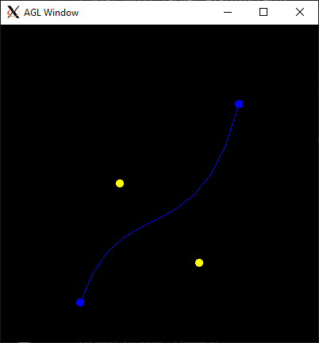
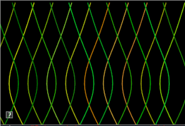

include::header.adoc[]

:title: Assignment 2: Howl's moving casteljau
:Author Initials: ASN
:Date:    2020-02-07
:Revision: 0.1
:Dir: assignments/a2-interp
:stem: latexmath

= {title}

_In which, we implement animations based on interpolation_

This assignment has *two parts!*

**Written part: Due Thursday, September 16th, in lab (~30 min worksheet)**

**Implementation part: Due Friday, September 24th, before midnight**

The goals of this lab are to

* understand derivations based On Bezier curves
* implement animations using linear interpolation
* implement animations using cubic interpolation

The written part is link:asst02-interpolation-written.html[here] and 
was given out in class as a handout. Please print the handout and write your answers 
inline.

= Get the source

On Github, do a `Fetch Upstream` to synchronize your forked repository with the class repository.

Then update the source on your local machine and rebuild.

[source]
----
> git pull
> cd build
> cmake ..; make
----

:sectnums:

= Gradient

A color gradient uses linear interpolation to gradually change from one color to another 
based on position. 

For this question, modify the code in *a2-interp/gradient.cpp* to implement a 2D gradient. 
Your program should open a square window and draw NxN cubes to fill it. The color of each 
cube will be a function of four colors and the cube's position. The four colors will correspond 
to the four corners of the screen: NE, SE, SW, NW. 

To run your program from the */build* directory, type 

[source]
----
build> ../bin/a2-gradient 
build-windows> ../bin/Debug/a2-gradient 
----

Let's suppose that 

* The northwest corner has color yellow (1,1,0). Let's name this color stem:[C^{nw}].
* The northeast corner has color cyan (0,1,1). Let's name this color stem:[C^{ne}].
* The southwest corner has color red (1,0,0). Let's name this color stem:[C^{sw}]
* The southeast corner has color fuchsia (1,0,1). Let's name this color stem:[C^{se}].

A 2D gradient is computed in two steps. Suppose our cube is at position stem:[(p_x, p_y)^T].
First, we interpolate from west to east.  Let stem:[t^x \in [0,1]] be computed based on stem:[p_x] 
and the window's width. 

[stem]
++++
C_0^x = C^{nw} * (1-t^x) + C^{ne} * t^x \\
C_1^x = C^{sw} * (1-t^x) + C^{se} * t^x
++++

Second, interpolate stem:[C_0^x] and stem:[C_1^x] based on the y direction. Let stem:[t^y \in [0,1]] be computed 
based on stem:[p_y] and the window's height.

[stem]
++++
C = C_0^{x} * (1-t^y) + C_1^{x} * t^y
++++

The final result is below

image::Labs/colorLerp3.png[]

= Draw Cubic

In the file *a2-interp/drawcurve.cpp*, implement an application that draws a cubic curve 
(and its control points) using both Bernstein polynomials and De Casteljau's algorithm. 

This application should hard-code the following control points:

* (100,  50 , 0)
* (150, 200 , 0)
* (250, 100 , 0)
* (300, 300 , 0)

When the user presses the '1' key, you should draw the curve by sampling the 
Bezier curve polynomial, e.g. 

[stem]
++++
p(t) = (1 - t)^3 b_0 + 3t(1-t)^2 b_1 + 3t^2(1 - t) b_2 t^3 b_3
++++

When the user presses the '2' key, you should draw the same curve using 
de Casteljau's algorithm. The two curves should look visually identical.

You may implement your application however you wish! 

To run your program from the */build* directory, type 

[code]
----
build> ../bin/a2-drawcubic 
----

= Cubic motion

Implement a demo, *a2-interp/particlecubic.cpp*, that 
animates the position of a particle based on a cubic polynomial. 

To run your program from the */build* directory, type 

[source]
----
build> ../bin/a2-particlecubic 
----

image::Labs/particleCubic.gif[]

Requirements:

* The particle should take 5 seconds to travel the curve.
* The particle should wrap to the beginning of the curve when it gets to the end. You can use any algorithm you want for this, but the simplest solution involves using the elapsed time and link:http://www.cplusplus.com/reference/cmath/fmod/[fmod]. 

= Screensaver

In class, we talked about how we can animate a curve by animating the 
control points. In this demo, we will compute a series of random curves and 
use linear interpolation between the control points to blend from one 
curve to the next. 

To run your program from the */build* directory, type 

[source]
----
build> ../bin/a2-screensaver 
----

We recommend you implement the demo in two steps.

== Single curve

We will interpolate between curves having random control points. You will need to manage three curves. 

* the starting curve (e.g. curve1), 
* the ending curve (e.g. curve2), and 
* a curve that stores the current interpolation between them. Let's call this curve 'current'

When the current curve reaches curve 2, we compute a new curve to interpolate towards. The algorithm 
looks like 

[source]
----
if t > 1
   t = 0
   curve1 = current
   curve2 = new random curve

current = interpolate between curve1 and curve2 based on t
----

image:Labs/screensaver1.gif[]

Requirements:

* You should randomize colors
* The animation should run forever (don't hardcode the number of curves)
* All control points should be within the bounds of the window
* Draw curve1, curve2, and current 

== Trail effect 

To implement a trailing effect, save the previously interpolated curves in a
link:http://www.cplusplus.com/reference/list/list/[list].  So we don't
run out of memory, we store at most N previous curves. In the demo below, N is
50. 

In the simplest trail implementation, we would add a new curve to our 
list every frame. In other words, whenever we update the current curve, we 
would also add it to our list. However, this creates a trail that has the 
lines close together. You should try this first.

To make a prettier effect, we should only save the current curve only after
T seconds have passed. In the demo below, X is 0.1 seconds. The algorithm looks
like

[source]
----
   timer = 0
   add current curve to a list
   if trail size > max size
      remove oldest curve from list
----

image::Labs/screensaver.gif[]

Requirements:

* You should randomize colors
* The animation should run forever (don't hardcode the number of curves)
* All control points should be within the bounds of the window
* Space out saving the current curve by T seconds. T > 0
* Store at most N curves in your trail. N > 5

= Be Unique!

Create a unique animation of your own choosing. Below are some ideas:

* Derive and implement a degree-N curve, N > 3
* Derive and implement different polynomials for interpolation, such as the ones link:https://easings.net/en[here]. Or create your own. 
* Implement a cool scene using curves, Create a scene with lots of curves or that integrate some interactivity from 
the user. Some ideas:
** Play with colors (gradients, palettes, jitter). Use a cubic curve to animate color.
** Use sine/cosine to animate the control points
** Let the user specify control points with mouse click
** Animate the positions, colors, and scale of different shapes using cubic curves 
* Animate one or more shapes using different interpolation curves.

image::Labs/squash.gif[width=200px]
image::Labs/wavy.gif[width=200px]

Be sure to describe your unique demo in your README.

include::handin.adoc[]
