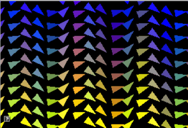

include::header.adoc[]

:title: Assignment 4: You spin me round
:Author Initials: ASN
:Date:    2020-02-07
:Revision: 0.1
:Dir: assignments/a4-euler
:stem: latexmath

= {title}

_ In which, euler angles and rotation matrices become part of our 3D programming skillset_

**Due Friday, Oct 8, before midnight**

The goals of this lab are to

* Understand the matrix form of euler angles
* Understand how to get euler angles from a rotations matrix
* Implement euler conversions 

In this assignment, you will implement conversions between euler angles 
and matrices. To help test your conversions, you have been given a grid of 
spinning teapots as well as a console program for unit testing. 

In the teapot viewer, you should see a grid of teapots. The UI on the top
left allows you to enter test values. Each teapot tests a conversion
function. This week, you will implement 6 of the teapots to match the top
right. In your next assignment, you will implement the remaining two teapots.

video::Labs/teapots.mp4[]

NOTE: For this assignment, you do not need to implement the quaternion conversions that animate the bottom, left two teapots.

NOTE: To type a value into the GUI's slider, do *control+<left click>*

= Get the source

On Github, do a `Fetch Upstream` to synchronize your forked repository with the class repository.

Then update the source on your local machine and rebuild.

[source]
----
> git pull
> cd build
> cmake ..; make
----

:sectnums:

= Euler to Matrix

In the file `libsrc/atkmath/matrix3-basecode.cpp`, implement the conversions from euler angles to a matrix.

NOTE: In this assignment, you will complete the implementations for *Matrix3* in `libsrc/atkmath`. You do not need to modify `assignments/a4-euler/teapots.cpp` or `assignments/a4-euler/test_euler.cpp`.

To start, implement the function `Matrix3::fromEulerAnglesZYX()`.  This function
takes a parameter called angleRad which stores euler angles as a 3-tuple

* angleRad[0] contains the rotation around the X axis (in radians)
* angleRad[1] contains the rotation around the Y axis (in radians)
* angleRad[2] contains the rotation around the Z axis (in radians)

NOTE: You will be implementing many similar functions. I recommend you add methods or functions to compute Rx, Ry, and Rz matrices.

In `matrix3.h`, you will see that `Matrix3` supports two types of syntax for accessing elements: indexing or by element name. For example, 

[source]
----
std::cout << mM[0][0] << std::endl; // indexing notation
std::cout << m11 << std::endl; // lecture matrix notation
mM[row][col] = 0.4;
m11 = 3;
----

* Implement `Matrix3::fromEulerAnglesZYX()`
* Implement `Matrix3::fromEulerAnglesXYZ()`
* Implement `Matrix3::fromEulerAnglesXZY()`
* Implement `Matrix3::fromEulerAnglesYZX()`
* Implement `Matrix3::fromEulerAnglesYXZ()`
* Implement `Matrix3::fromEulerAnglesZXY()`

Use the utility `test_euler.cpp` to help you implement your methods. Note that you can add more tests to this utility to help debug special cases!

[source]
----
build> ../bin/a4-test-euler 
----

When a test fails, it prints the expected value followed by the computed value, for example,

[source]
----
ZYX
  TEST FAIL
  0 0 1
0 -1 0
1 0 0

  1 0 0
0 1 0
0 0 1
----

= Matrix to Euler

In class, we derived recipes for extract euler angles from XYZ and ZYX rotation matrices. In this question, derive the remaining formulas for extracting euler angles and implement them in your basecode.

In your implementation, be carefull of edge cases around 90 degrees! 

* Implement `Matrix3::toEulerAnglesZYX()`
* Implement `Matrix3::toEulerAnglesXYZ()`
* Implement `Matrix3::toEulerAnglesXZY()`
* Implement `Matrix3::toEulerAnglesYZX()`
* Implement `Matrix3::toEulerAnglesYXZ()`
* Implement `Matrix3::toEulerAnglesZXY()`

To run the teapots from the *build* directory, type 

[source]
----
build> ../bin/a4-teapots 
----

To run the unit tests from the *build* directory, type 

[source]
----
build> ../bin/a4-test-euler 
----

NOTE: Implement the special cases (e.g. when the middle angle is 90 or -90 degrees) after implementing the main algorithms for each case. 

= Be Unique!

Implement your own unique animation or image in `a4-euler/unique.cpp`. Some ideas:

* Make a demo with rotating objects
* Make a cone that follows a trajectory
* Create a shape whose orientation and position is controlled using the keyboard

image::Labs/flower.gif[height=200px]

include::handin.adoc[]