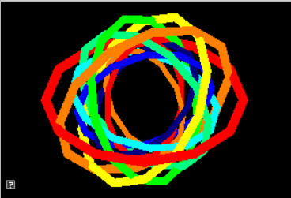
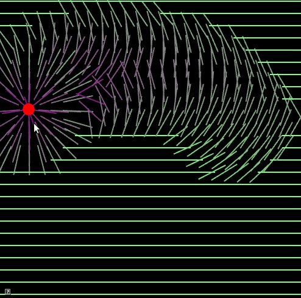
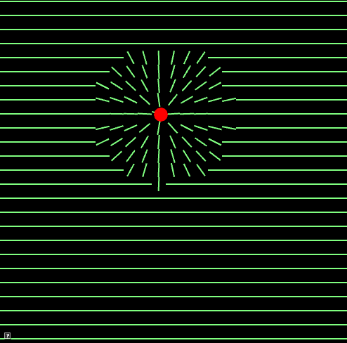

include::header.adoc[]

:title: Assignment 5: Quazy Quaternions
:Author Initials: ASN
:Date:    2020-02-07
:Revision: 0.1
:Dir: assignments/a5-quat
:stem: latexmath

= {title}

_Quaternions, matrices, and you!_

**Due Friday, Oct 22, before midnight**
     
The goals of this lab are to 

* Implement angle/axis to quaternion conversions
* Implement quaternion to matrix conversions
* Use rotations in an animation (based on the code your wrote for lab 4)

After completing this assignment, all teapots from lab 4 should spin in unison!

= Get the source

On Github, do a `Fetch Upstream` to synchronize your forked repository with the class repository.

Then update the source on your local machine and rebuild.

[source]
----
> git pull
> cd build
> cmake ..; make
----

:sectnums:

= Quaternion

Finish the quaternion implementation in `libsrc/atkmath`. Use the utility, 
`a5-test-quat` to check your work. 

[source]
----
build> ../bin/a5-test-quat 
----

Once all your conversions are working, link:asst04-euler.html[your teapot demo will also be fully operational]!

== Angle/Axis 

Implement conversions between quaternions and the 
angle-axis representations for rotation.

Recall that the relationship between quaternions and an angle/axis rotation is

\(
q = \left[\sin(\frac{\theta}{2}) \hat{u}, \cos(\frac{\theta}{2})\right]
\) 

* Implement `Quaternion::fromAngleAxis` in `libsrc/atkmath/Quaternion-basecode.cpp` 
* Implement `Quaternion::toAngleAxis` in `libsrc/atkmath/Quaternion-basecode.cpp`
* Implement `Matrix3::fromAngleAxis` in `libsrc/atkmath/Matrix3-basecode.cpp` using a direct angle/axis to matrix implementation 
* Implement `Matrix3::toAngleAxis` in `libsrc/atkmath/Matrix3-basecode.cpp` using a direct matrix to angle/axis implementation

To run the unit tests from the <b>build</b> directory, type 

[source]
----
build> ../bin/a5-test-quat 
----

Accessing member variables in Quaternion works similarly to Matrix3

[source]
----
void Quaternion::foo() {
    // accessing member variables in Quaternion works similarly to Matrix3
    mX = 0.5;
    mY = 0.0;
    mZ = 3.0;
    mW = -5.0;
    normalize(); // make myself a unit quaternion
}

void foo() {
    AQuaternion q; // create an identity quat
    q[0] = 0.1; // x value
    q[1] = 0.1; // y value
    q[2] = 0.1; // z value
    q[3] = 0.1; // w value
    q.normalize(); // make q a unit quaternion
}
----

The output of `test-quat` should be

[source]
----
45 Z 0 0 0.382683 0.92388 0 0 1 45
45 Y 0 0.382683 0 0.92388 0 1 0 45
45 X 0.382683 0 0 0.92388 1 0 0 45
----

== Matrix 

In class, we derived the rotation matrix corresponding to a quaternion 

[stem]
++++
q = (x, y, z, w) = (\bar{v}, w )
++++

[stem]
++++
\left( \begin{array}{ccc}
1-2(y^2+z^2) & 2(x y - w z) & 2(x z + w y) \\
2(x y + w z) & 1-2(x^2+z^2) & 2(y z - w x) \\
2(x z - w y) & 2(y z + w x) & 1-2(y^2+x^2) \\
\end{array} \right)
++++

* Implement the above matrix to convert from a Quaternion to a Matrix3 in `Quaternion::toMatrix()` located in `libsrc/atkmath/Quaternion-basecode.cpp`
* Implement the algorithm for converting from Matrix3 to Quaternion in `Quaternion::fromMatrix()` in `libsrc/atkmath/Quaternion-basecode.cpp`.

To run the tests from the `build` directory, type 

[source]
----
build> ../bin/a5-test-quat-mat 
build> ../bin/a4-teapots
----

The output of `test-quat-mat` should be

[source]
----
45 Z 0 0 0.382683 0.92388
45 Z
0.707107 -0.707107 0
0.707107 0.707107 0
0 0 1

45 Y 0 0.382683 0 0.92388
45 Y
0.707107 0 0.707107
0 1 0
-0.707107 0 0.707107

45 X 0.382683 0 0 0.92388
45 X
1 0 0
0 0.707107 -0.707107
0 0.707107 0.707107
----

= Be Unique!

Implement your own unique animation or image in `a5-quat/unique.cpp`. Some ideas:

* Make a new demo with objects that rotate around an arbitrary axis
* Create a shape whose orientation and position is controlled using the keyboard

include::handin.adoc[]