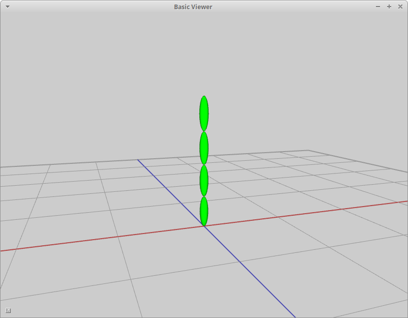

include::header.adoc[]

:title: Assignment 6: Characters, big and small
:Author Initials: ASN
:Date:    2020-02-07
:Revision: 0.1
:Dir: assignments/a6-transform
:stem: latexmath

= {title}

_In which, we take our first steps making our characters step_

**Due Friday, Oct 29, before midnight**
     
The goals of this lab are to 

* Implement slerp
* Implement a simple keyframed animation
* Work with skeletons
* Create and animate simple characters

= Get the source

On Github, do a `Fetch Upstream` to synchronize your forked repository with the class repository.

Then update the source on your local machine and rebuild.

[source]
----
> git pull
> cd build
> cmake ..; make
----

:sectnums:

= Slerp

Implement `Quaternion::Slerp()` in
`libsrc/atkmath/quaternion-basecode.cpp`

To run the unit tests from the `build` directory, type 

[source]
----
build> ../bin/a6-test-slerp 
----

To run the class teapot demo from the `build` directory, type 

[source]
----
build> ../bin/a6-slerp-teapot 
----

image::Labs/slerpTeapot.gif[]

//= Keyframe animation
//
//In the file `keyframe-cone.cpp`, implement a simple animation using linear and spherical interpolation. 
//
//image::coneAnimate.gif
//
//Your solution should have the following features:
//
//* The cone should travel between the four corners (100,0,100), (-100,0,100), (-100, 0, -100), (100,0,-100) 
//* The cone should have size (10,10,20).
//* The forward direction of the cone is +Z. You should define keys for the cone's rotation that face it in the direction in which it is traveling. This rotation will be around the +Y axis. 
//* The cone should pause to turn.
//* You should animate positions using ASpline and rotations using AQuatSpline 

= Stacking Boxes

The `atk::Transform` class represents a 4x4 homogeneous transform as a 2x2 block matrix. 
The transform's rotation \(R_j^i\) and translation \(d_j^i\) are public variables. 
Because the bottom row of such matrices are always known, we do not 
store them. Instead, we store the top left block as a rotation (Quaternion) and the 
top right column as a vector. 

For this question, you will use the transform class to position several boxes.
Look at the code in `assignments/a6-transform/boxes.cpp`. 
 You will need to modify it.

A room has three boxes in it. Each box has a local coordinate system
attached to it. The lengths of all three boxes in the x,y, and z directions of
their local coordinate frames are (3,2,1) respectively. The origin of each box
is in the lower left-hand corner.  The z-axis of each box is aligned with the
global Z axis.

* The position of B1 with respect to the world (e.g. the coordinate system corresponding to \(X_0, Y_0, Z_0 \)) is
\(p_1 = (-2, 0, 1)^T \).
* The position of B2 with respect to the world is \( p_2 = (4, 0, 2)^T \). The rotation of B2 with respect to the world is 45 degrees around the Z axis.
* The position of B3 with respect to the world is \( p_3 = (5, 4, 2)^T \). The rotation of B3 with respect to the world is 90 degrees around the Z axis.

image::Labs/boxes-2019.png[height=200px]

In your lab for this week, you will manually solve for the transforms corresponding to the above picture. 
In this assignment, you will implement the solutions in `assignments/a6-transform/boxes.cpp`.

To run the demo from the `build` directory, type

[source]
----
build> ../bin/a6-boxes 
----

= Skeleton

In this question, you will learn about the `atk::Skeleton` and `atk::Joint` classes in your basecode.

First, read the header files for Skeleton and Joint in `libsrc/atk/skeleton.h` and 
`libsrc/atk/joint.h`.

Second, complete the program in `assignments/a6-transform/skeleton.cpp`
This program loads a BVH file and prints information about the character in it. 
For more details, read below.

To run the demo from the `build` directory, type

[source]
----
build> ../bin/a6-skeleton 
----

The **Skeleton** class implements a hierarchy of joints using a tree data structure. Using the skeleton class, 
users can iterate over joints and navigate through the joint hierarchy using depth- or breadth- first searches.

The **Joint** class stores two transforms: one that converts from the local frame of the joint to its parent (called **local2parent**); 
and one that converts from the local frame to the global frame (called **local2global**). When a skeleton is created, each joint must be 
initialized with its local to parent transform. A joint's local to global transform is only computed later, 
when the user calls `Skeleton::fk()`. Joints also store an ID, name, parent pointer, and list of children pointers.
The root joint always has an ID of zero and a NULL parent pointer.

//You can create characters from scratch using the methods in Skeleton and Joint.
//However, we usually load characters (and motion) from a file. Your basecode
//supports a file format called 
//link:https://research.cs.wisc.edu/graphics/Courses/cs-838-1999/Jeff/BVH.html[BVH].
//The first part of the file contains the hierachy of joints and the second part 
//contains root positions and joint orientations to use for animation. A BVH
//reader is defined in the class `atk::BVHReader` in `libsrc/atk/bvhreader.cpp`.

= Tentacle 

*Forward kinematics (FK)* is an algorithm that allows us to efficiently compute the global positions of 
the end effectors of a character, given the local2parent transforms at each joint. A by-product of this 
process is that we also get the local2global transforms for _every_ joint in the skeleton, meaning we 
also get the global positions of every joint.

== Skeleton

In this demo, we will define a tentacle character and then draw it using the global positions of each joint.

[source]
----
void scene()
  for each joint
    if the joint is the root
       continue

    p1 = global position of the parent joint
    p2 = global position of the joint
    draw a limb between p1 and p2 
----

Tips and requirements:

* Your skeleton should have at least 5 joints (including the root)
* Each joint is 50 units from its parent. To make this easier, let the offset of each joint from its parent by along the local X-axis. 

== Motion

Use sine to animate each joint of the tentacle. 

* Rotate each joint around its local Z axis.
* Use sine to compute the angle of rotation around each joint's local Z axis. 
* Offset the angle of rotation for each joint to make the animation more interesting 

image::Labs/tentacle.gif[height=320]

= Be Unique

Create and animate your own character (or characters) consisting of multiple body parts. 
Try setting keyframes or defining procedural motions using functions like sine or the rose curves.
Feel free to also add particle effects for extra flare!

include::handin.adoc[]
