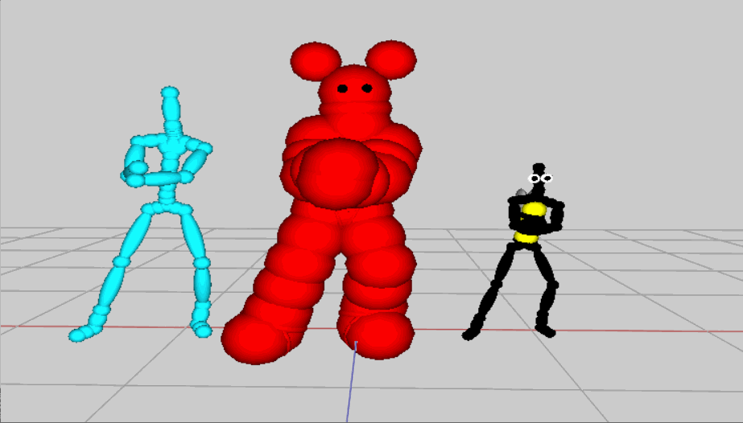

include::header.adoc[]

:title: Assignment 7: Commotion of motion
:Author Initials: ASN
:Date:    2020-02-07
:Revision: 0.1
:Dir: assignments/a7-motion
:stem: latexmath

= {title}

_In which, we begin work with more complex characters_

**Due Friday, Nov 5, before midnight**
     
The goals of this lab are to 

* Work more with transforms
* Attach geometry to joints using the matrix stack
* Begin working with motion capture data
* Animate more complex characters

= Get the source

On Github, do a `Fetch Upstream` to synchronize your forked repository with the class repository.

Then update the source on your local machine and rebuild.

[source]
----
> git pull
> cd build
> cmake ..; make
----

:sectnums:

= Motion Practice

For this question, use the APIs in `Motion`, `Pose` and `Skeleton` 
to finish the implementation in `assignments/a7-motion/practice_motion.cpp`.

*`Motion` is defined in `libsrc/atk/motion.h`
*`Skeleton` is defined in `libsrc/atk/skeleton.h`
*`Pose` is defined in `libsrc/atk/pose.h`

To run the demo from the `build` directory, type 

[source]
----
build> ../bin/a7-motion-practice 
----

`Motion` implements a fixed-framerate motion loaded from a 
link:https://research.cs.wisc.edu/graphics/Courses/cs-838-1999/Jeff/BVH.html[BVH file].  A motion stores a sequence of a <b>APose</b>. Each APose stores the
state of the skeleton on that frame .  Because `Motion` represents motions with
a fixed framerate, the time between each key is 1/fps. Fps stands for frames
per second. For the characters in this class, poses contain the root position
and the rotations for each joint. All pose data is always in local coordinates.
The order of the joint rotations in `Pose` matches the IDs in
`Skeleton`.  For example, the joint with ID = 5 has its local rotation
stored in jointRots[5].

Running this program should produce the following output

[source]
----
The number of frames is 32
The frame rate is 30
The duration of the animation is 1.03333
The root position on frame 5 is: vec3(1.069900, 91.642601, 25.193100)
The local rotation of the left hand on frame 5 is: vec3(0.136196, -0.027970, -0.351661)
The speed of the motion is (units/s): 2.90323
----

= Motion viewer

Complete the program, `motion_viewer.cpp`, that loads and plays different BVH files from the command line 
and allows the user the pause, play, and step through a motion. 

[source]
----
build> ../bin/a7-motion-viewer
build> ../bin/a7-motion-viewer ../motions/Beta/idle.bvh
----

Requirements:

* By default, your viewer should load a default motion. In other words, if no file name is given, the program should still show an animated character.
* Pressing the 'P' key should toggle play and pause
* Pressing the '0' key should reset the motion to the first frame
* If the motion is paused, pressing '.' should step forward one frame. The motion should wrap to the first frame.
* If the motion is paused, pressing ',' should step backward one frame. The motion should wrap to the last frame.
* Pressing the ']' key should increase the playback speed.
* Pressing the '[' key should decrease the playback speed.

Hints and Tips:

* Use the sample program, ``, from class to see how you can use your basecode to load and visualize a BVH motion.
* link:https://www.geeksforgeeks.org/command-line-arguments-in-c-cpp/[Command line argument (simple examples)]
* Override the method link:https://alinen.github.io/agl/html/classagl_1_1_window.html#a022bd571eae1add76f1f06b4e4a4e8a3[keyUp()] to implement your controls

NOTE: If you are in windows, you can run your program with arguments from `git bash`, where you run cmake. Or you can specify command line arguments in your project properties, inside visual studio

video::Labs/motion-viewer.mp4[height=400]

= Thriller

In the file, `thriller.cpp`, implement dancers performing the 80s classic: Thriller!
Note that to draw multiple characters with the same synchronized animations,
we only need one skeleton and multiple drawers!

To run the demo from the `build` directory, type 

[source]
----
build> ../bin/a7-thriller 
----

video::Labs/thriller.ogv[]

Your solution should have the following features:

* The basecode uses a "Devil" object to draw each character. Use a vector or array to store multiple "Devil" objects. Each object can have its own color, position, and size. 
* Arrange 12 characters in a 4x3 grid across the floor.
* Jitter the positions of the characters so that the alignment is not exact.
* Randomize the colors of the characters. 
* Randomize the sizes of the characters. 

= Butterfly

In the file `butterfly.cpp`, extend the butterfly demo from class to have more interesting wings and movement.

To run the demo from the `build` directory, type 

[source]
----
build> ../bin/a7-butterfly 
----

image::Labs/butterfly.gif

Your solution should have the following features

* Two+ primitives for each wing
* Animated wings
* Animated body
* An option to display the coordinate axes for the body
** Use red for the x axis
** Use green for the y axis
** Use blue for the z axis

Hints and tips:

* To display the coordinate axes, define the origin and axes in local coordinates and use the body's local-to-global transform to convert them to global points and directions. Use `drawEllipsoid` to draw the axes. 
* Use the body's coordinate axes to help you size and place the wings. (The wings' frames align with the body's frame).

= Paper Doll

In `squirrel.cpp` (under assignments), implement a posable character consisting of 
sprites using a matrix stack. 

This program supports the following controls:

* Pressing 1,2,3,4 switched the current body part
* Pressing the UP and DOWN keys rotates the body part

You have starting basecode for this program. This program loads images for the
body, tail, legs, and arms. When each image is loaded, we also setup a `pivot` point (in local 
coordinates) which indicates where we want the part to rotate. For example, we load the body with

[source]
----
  loadSprite("body", vec3(0.5, 0.5f, 0.0f), "../models/squirrel/squirrel-body.png");
----

This loads the body image and sets the pivot point to 50% of the image width and
50% of the image height (e.g. the middle of the image).

Program requirements and hints:

* You must draw the parts of the body from back to front. This ensures that the layering works correctly.
* You should use `push()` and `pop()` to manage the transforms correctly.
* To position the sprites, use the following series of transformations (listed starting from local coordinates)
** When you call `drawSprite`, you draw the image in its local coordinate system, which centers the image at the origin. 
** Next, translate the sprite so the pivot is aligned with the origin
** Next, rotate
** Next, translate relative to its parent

video::Labs/Squirrel.mp4[height=400]

= Be Unique

Create and animate your own character (or characters) consisting of multiple body parts. 
Try setting keyframes or defining procedural motions using functions like sine or the rose curves.
Feel free to also add particle effects for extra flare!

Some ideas:

* Look online for BVH files of different motions
* Customize the appearance of a skeletal character (add a top hat and monocle; crown and sword; or whatever your imagine!)
* Create your own paper doll animation, or general collage scene (Have you seen Monty Python's Flying Circus?)
* Try using spites for the butterfly wings
* Create a procedural animation (for example with sin/cos/tan)
** Try animating the arms to make a dance motion.
** Try animating a tapping foot
** Try animating gaze

include::handin.adoc[]
