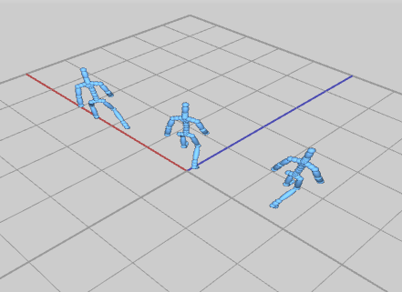

include::header.adoc[]

:title: Assignment 8: Blending in
:Author Initials: ASN
:Date:    2020-02-07
:Revision: 0.1
:Dir: assignments/a8-blend
:stem: latexmath

= {title}

_In which, we implement blending and reorienting between motions_

**Due Friday, Nov 12, before midnight**
     
The goals of this lab are to 

* Implement spliced motions
* Implement blends between similar motions
* Modify animations for a part of the body
* Align motion sequences for blending

= Get the source

On Github, do a `Fetch Upstream` to synchronize your forked repository with the class repository.

Then update the source on your local machine and rebuild.

[source]
----
> git pull
> cd build
> cmake ..; make
----

:sectnums:

= Blend

In this question, you will blend the walk motion with a strafe motion.
Implement your solution in <b>assignments/a8-blend/ABlend.cpp</b> inside of 
the method <b>blend()</b>.

[source]
----
// m1: First input motion
// m2: Second input motion
// alpha: blend value
// returns the result of m1 * (1-alpha) + m2
Motion blend(const Motion& m1, const Motion& m2, double alpha) 
----

This function should implement the algorithm from class

[source]
----
duration = duration1 * (1-alpha) + duration2 * alpha
deltaT = 1/fps
for t from 0 to duration, increment by deltaT
    Pose pose1 = pose from motion1
    Pose pose2 = pose from motion2
		Pose newPose = lerp pose1 and pose2 by alpha
		result.appendKey(newPose)
return result
----

To run the demo from the `build` directory, type 

[source]
----
build> ../bin/a8-blend 
----

Controls

* Press 'UP' to increase the blend factor _alpha
* Press 'DOWN' to decrease the blend factor

Your program should have the following features

* `blend()` should create and return a new motion. Use `Motion::appendKey` to add poses to your blended motion
* The motion returned by blend should have a framerate equal to motion1. Hint: Call setFramerate() before returning result.
* The duration of the blended motion should be based on the blend factor, e.g. duration = duration1 * (1-alpha) + duration2 * alpha. 
* Use `Pose::Lerp` to blend poses from motion1 and motion2

= Splice

In the file `splice.cpp`, implement a character that walk and dance gangnam style at the same time. 

[source]
----
// orig: Starting input motion
// upper: Motion for the modifying the upper body (all joints which are descendants of the spine)
// alpha: blend value
// returns a new motion such that 
//     the lower body matches the motion in 'orig'
//     the upper body is the result of blending the upper body motion with 
//         the original's upper body motion, e.g. newupper = upper * (1-alpha) + orig * alpha
Motion spliceUpperBody(const Motion& orig, const Motion& upper, double alpha) 
----

For this question, use keys for blending instead of durations, e.g.

[source]
----
for i in range numKeys in orig
    Pose pose = orig.getKey(i)
		// compute new pose and either call appendKey() or editKey() set the pose
    // editPose() replaces an existing key; appendPose() adds the key to the end of the motion
----

To run the demo from the `build` directory, type 

[source]
----
build> ../bin/a8-splice 
----

image::Labs/splice-gangnam-walk.gif[]

Controls

* Press 'UP' to increase the blend factor _alpha
* Press 'DOWN' to decrease the blend factor

Your program should have the following features

* `spliceUpperBody()` should create and return a new motion. Use AMotion::appendKey to add poses to your blended motion
* The motion returned by blend should have a framerate equal to orig
* The upper body consists of all descendants of the joint "Beta:Spine1" 
* Use `glm::slerp` to blend local rotations for the upper body
* In the above demo, we use start splicing the poses of the upper body starting at key = 120

= Zombie Arms

In the file, `zombie.cpp`, implement a character that walks with zombie arms. 
Your implementation should load the motion, `walk.bvh`, and modify the arm motion to 
create this effect. We will implement and compare two techniques for modifying the arms: "Freeze" and "Offset".

To run the demo from the `build` directory, type 

[source]
----
build> ../bin/a8-zombie 
----

Controls

* Press '0' to see the original motion
* Press '1' to see the arms with a constant rotation
* Press '2' to see the arms with an offset rotation

== Freeze 

To `freeze` the arms, we will set both the shoulders and elbows to a constant
rotation. Implement your solution in the function `computeArmFreeze`.

[source]
----
// motion: input motion
// returns a new motion with the shoulders and elbows outstretched
Motion computeArmFreeze(const Motion& motion)
----

video::Labs/zombieFreezeArms.ogv[]

Freeze arms should have the following features:

* The left shoulder should local rotation equal to XYZ euler angles (-53, -88, -33) 
* The right shoulder should local rotation equal to XYZ euler angles (14, 88, -33) 
* Both elbows should local rotation equal to XYZ euler angles (0, 23, 0) 
* The motion returned should have a framerate equal to motion
* You should modify the joints with names: "Beta:LeftArm", "Beta:RightArm" (shoulders), "Beta:LeftForeArm", and "Beta:RightForeArm" (elbows). 

== Offset

To offset the arms, we will apply an offset rotation to shoulder's animation 
curve. We will freeze the elbows as before. 
Implement your solution in the function `computeArmOffset`.

[source]
----
// motion: input motion
// returns a new motion with the shoulders and elbows outstretched but moving
Motion computeArmOffset(const Motion& motion)
----

To compute the offset, we will 
use the local rotation of the should on the first frame to compute an offset 
rotation.

[stem]
++++
R_{offset} = R_{desired} (R_i^j)^{-1}
++++

where stem:[R_i^j] is the local to parent rotation for the shoulder joint. stem:[R_{desired}] is the target rotation we want for the joint. For the right joint, 
the desired rotation will be the XYZ euler angles (14, 88, -33). For the 
left joint, the desired rotation will be the XYZ euler angles (-53, -88, -33). Be mindful that these angles are in degrees, not radians!

video::Labs/zombieOffsetArms.ogv[]

Offset arms should have the following features:

* The left shoulder's desired rotation is XYZ euler angles (-53, -88, -33) 
* The right shoulder's desired rotation is XYZ euler angles (14, 88, -33) 
* Both elbows should local rotation equal to XYZ euler angles (0, 23, 0). These frozen as before.
* The motion returned should have a framerate equal to motion
* You should modify the joints with names: "Beta:LeftArm", "Beta:RightArm" (shoulders), "Beta:LeftForeArm", and "Beta:RightForeArm" (elbows). 

= Reorient

In the file `reorient.cpp`, you will modify a motion so it starts in a new location
and orientation. You will need to perform the same calculation in crossfade to
align two motions. 

[source]
----
// motion: the input motion
// pos: the new starting position of the motion
// heading: the new starting orientation as an angle (radians) around the world UP axis (e.g. Y)
// returns a new motion whose starting pose has a root position and rotation that matches pos and heading
Motion reorient(const Motion& motion, const vec3& pos, double heading)
----

To run the demo from the `build` directory, type 

[source]
----
build> ../bin/a8-reorient 
----

video::Labs/reorient.ogv[]

Controls

* Use the left and right arrow keys to rotate
* Use WASD to translate forward, back, left, and right

Your demo should have th following features

* The returned motion should have the same framerate as the input
* The root position and heading of the first frame should match the desired position and heading. All subsequent frames should be offset so the resulting motions looks like the original. 
* The best solution should only align the headings. However, you may implement a simpler solution which sets the full XYZ orientation to match the heading. This will affect how motions where the root may tilt (such as jumps) are reoriented. 

= Unique

Personalize at least one of the demos from this week. Some ideas:

* Support additional commands in your controller (such as dance, or jumping)
* Create a unique character
* Add a particle trail that emits from your character as it walks around
* Create an interesting environment for your character to move around in 
* Use blending in your controller
* Procedurally create a silly walk 

In your README, be sure to describe what your customizations.

include::handin.adoc[]