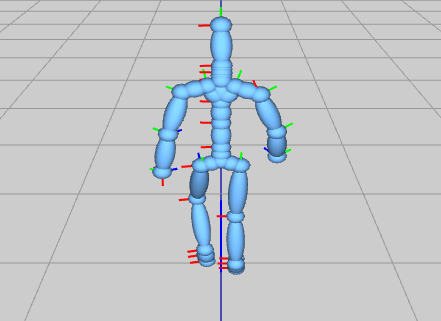

include::header.adoc[]

:title: Assignment 9: Cross-fade away
:Author Initials: ASN
:Date:    2020-02-07
:Revision: 0.1
:Dir: assignments/a9-ik
:stem: latexmath

= {title}

_In which, we implement several popular techniques_

**Due Friday, Nov 19, before midnight**
     
The goal of this lab is to 

* Align motion sequences for blending
* Implement cross-fade
* Implement video-game character controls
* Implement the two-link analytic IK algorithm from class

= Get the source

On Github, do a `Fetch Upstream` to synchronize your forked repository with the class repository.

Then update the source on your local machine and rebuild.

[source]
----
> git pull
> cd build
> cmake ..; make
----

:sectnums:

= Crossfade

In the file, `crossfade.cpp`, you will implement crossfade transitions between two motions. 

To run the demo from the `build` directory, type

[source]
----
build> ../bin/a8-crossfade 
----

This executable takes command line arguments.  By default, the above will load
walking.bvh and jump.bvh with a 10 frame transition between them.

[source]
----
../bin/a8-crossfade [-m1 <motion1>] [-m2 <motion2>] [-nframes <num transition frames>]
----

Implement your solution in `crossfade(int numBlendFrames)`. This method should generate a 
new motion, stored in the instance variable `_blend`, that blends from `_motion1` to `_motion2` 
over `numBlendFrames` frames. In your case code, the corresponding frames from motion1 and 
motion2 are computed for you. 

You should build up your solution in steps and define methods to keep your code cleaner.

== Append

To start, simply create a new motion which combines the keys from walk with the keys from jump.

image::Labs/crossfade-append.gif[]

== Crossfade

So far, the transition snaps from the first motion to the 
second motion. Now implement the crossfade. This function 
should blend the frame between motion 1 and motion 2 and append the blended frames to 
`_blend`. 

Now, your assignment should look as follows: the motion is smooth but the character slides to 
the origin to play the jump motion.

image::Labs/crossfade-blend1.gif[]

== Align

Now we have a smooth result but the jump unrealistically 
moves back to the origin. We want the jump to occur at the character's current location! 
We will fix this by aligning the sequence from motion 2 with the start transition key from 
motion 1. Note that you can re-use the logic from `reorient`!

You can also implement this in steps. For example, first 
translate the keys so that the second sequence is aligned with the first sequence. 

image::Labs/crossfade-blend2-walkjump.gif[]

However, note that blending between a turn and jump still doesn't work! Let's fix that.

image::Labs/crossfade-blend2-turnwalk.gif[]

Reorient the keys (e.g. rotate and translate) so that the second sequence is
aligned with the first. Now your blend should look good in all cases.

image::Labs/crossfade-blend3.gif[]

NOTE: **Testing tip** A correct crossfade should return the original motion whenever 
you crossfade between the same motion. For example, try blending two walk motions 
over the starting 10 frames. The result should look identical to the original motion. 

= Controller

In the file, `controller.cpp`, implement a character that can be controlled using the keyboard. 
We will use the motion from `motions/Beta/walking.bvh` to animate the body but 
the root will be animated based on keyboard input.

To run the demo from the `build` directory, type 

[source]
----
build> ../bin/a9-controller 
----

Controls:

* Pressing 'a' will turn the character left
* Pressing 'd' will turn the character right

The user can change the heading of the character by pressing 'a' and 'd' keys.
This has been implemented for you in the basecode.  Again, we will build this
demo up in steps

*Pin the root*

Modify the pose of the skeleton so that the character's body animates but does not move.

image::Labs/wasd1.gif[]

//image::Labs/wasd2.gif[]

*Turn the body to match the heading*

Modify the pose of the skeleton so that the character rotates with the heading

image::Labs/wasd3.gif[]

*Set the camera to follow the character*

When we update the character, modify the camera position and look target so that it's behind the 
character's head. Use the global position of the character's head to compute positions  
for the camera. You will need global positions for the camera's position and for the target 
where the camera is looking. 

[source]
----
vec3 globalPos;
vec3 globalLookPos;
...
lookAt(globalPos, globalLookPos, vec3(0,1,0) /*up*/);
----

image::Labs/wasd4.gif[]

*Update the character position*

Modify the pose of the skeleton so that the character both rotates and moves with the heading. 
Update the position of the skeleton's root similarly to how you animated 
a particle to move in a straight line. In this case, velocity is based on the heading and the 
desired speed.

= Two-link analytic method 

In the file, `twolink.cpp`, implement a two-link kinematic chain using the algorithm from class.

[source]
----
// Place the Skeleton's end effector at goalPos
// Skeleton will contain a two-link chain
// Assume joint 0 is the root
// Assume joint 1 is the middle joint
// Assume joint 2 is the end effector
void solveIKTwoLink(Skeleton& skeleton, const vec3& goalPos) 
----

To run the demo from the `build` directory, type 

[source]
----
build> ../bin/a9-twolink 
----

NOTE: When you change the local rotation of a joint, you must call fk() to update the global rotations and translations.

When implementing solveIKTwoLink(), it is best to approach the task systematically. For example,

* First, set the goal position to something along the x axis. For example, set the goal position to (100,0,0) in the UI.
** Solve for stem:[\theta_{2z}] and set the rotation for the elbow. If done correctly, the distance
between the wrist and root will match the distance between the goal position and the root. Print out the distance between the wrist and shoulder. It should be 100.
** Next, solve for \(\theta_{1z}\) and set the rotation for the root. If done correctly, the wrist should be at the desired position exactly.
* Last, solve for full root rotation in terms of \(\gamma\) and \(\beta\). Once correct, the wrist position should match the goal position -- so long as it is in reach.

video::Labs/2link.mp4[height=400]

The basecode includes a simple interface and 3D viewer. See above for a demo. 

The camera can be controlled with the mouse:

* Left-button drag with the mouse to rotate
* Right-button drag with the mouse to pan
* Middle-button drag with the mouse to zoom

The player control panel on the top left can be used to move the goal position.

= Unique

Personalize one the demos from this assignment. Below are some ideas:

* Support more actions for your character, such as jumping
* Modify your character to carry something
* Create a trailing effect for your character
* Create a unique looking character or environment.
* Animate 2-link arm capable of catching an object
* Create a character animated procedurally using IK

include::handin.adoc[]