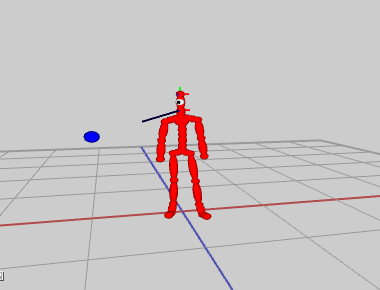

include::header.adoc[]

:title: Assignment 10: Reach for your goals
:Author Initials: ASN
:Date:    2020-02-07
:Revision: 0.1
:Dir: assignments/a9-ik
:stem: latexmath

= {title}

_In which, we use inverse kinematics to animate our characters_

**Due Friday, Nov 19, before midnight**
     
The goal of this lab is to 

* Implement two-link analytical and CCD algorithms on our character
* Implement procedural animations based on IK

= Get the source

On Github, do a `Fetch Upstream` to synchronize your forked repository with the class repository.

Then update the source on your local machine and rebuild.

[source]
----
> git pull
> cd build
> cmake ..; make
----

:sectnums:

= Two-link analytic method 

In the file, `twolink.cpp`, implement a two-link kinematic chain using the algorithm from class.

[source]
----
// ASkeleton will contain a two-link chain
// Assume joint 0 is the root
// Assume joint 1 is the middle joint
// Assume joint 2 is the end effector
// If your implementation is correct, the end effector should be positioned at goalPos
bool solveIKTwoLink(Skeleton& skeleton, const vec3& goalPos) 
----

To run the demo from the `build` directory, type 

[source]
----
build> ../bin/a9-iksimple 
----

NOTE: When you change the local rotation of a joint, you must call fk() to update the global rotations and translations.

When implementing updateIK(), it is best to approach the task systematically. I strongly recommend the following approach

* First, set the goal position to something along the x axis. For example, set the goal position to (100,0,0) in the UI.
** Solve for \(\theta_{2z}\) and set the rotation for the elbow. If done correctly, the distance
between the wrist and root will match the distance between the goal position and the root. Print out the distance between the wrist and shoulder. It should be 100.
** Next, solve for \(\theta_{1z}\) and set the rotation for the root. If done correctly, the wrist should be at the desired position exactly.
* Last, solve for full root rotation in terms of \(\gamma\) and \(\beta\). Once correct, the wrist position should match the goal position -- so long as it is in reach.

image::Labs/2link.ogv[]

The basecode includes a simple interface and 3D viewer. See above for a demo. 

The camera can be controlled with the mouse:

* Left-button drag with the mouse to rotate
* Right-button drag with the mouse to pan
* Middle-button drag with the mouse to zoom
* 'f' button will focus the view on the character

The player control panel on the top left can be used to play/pause, step through keys, and see the simulation time.

The panel at the bottom left can be used to set the goal position of the end effector. 
The target position can also be moved with the mouse by holding down the Ctrl key.

= Eye on the prize

In the file, `looker.cpp`, implement a character whose gaze follows a target. 

Your algorithm should use the CCD's angle/axis computation (with nudge factor of
1) to align the forward direction of the head with the target. The forward
direction of the head is the Z axis (0,0,1) in its local coordinates. 

To run the demo from the `build` directory, type 

[source]
----
build> ../bin/a9-looker
----

= Character IK

In the file, `skeleton_ik.cpp`, implement a poseable character using the CCD algorithm. 
This file implements a class which overrides `Skeleton` to support joints whose positions can be 
set using global coordinates. Inverse kinematics is used to calculate the corresponding local 
rotations of the interior joints.

== CCD 

Implement the CCD algorithm `SkeletonIK::solveIKCCD()`.

<pre>
// solveIKCCD positions the joint given by jointid so its global position
// is located at goalPos
//
// param skeleton: the character to modify
// param jointid: the ID of the end effector
// param goalPos: the target position for jointid (global pos)
// param chainSize: the number of joints to "nudge" towards the goal. (e.g. the number of descendants to use)
// param maxIters: the max number of iterations to try to reach the goal
// 
// return true/false based on whether we could reach the goal
// side effect: skeleton should by posed such that jointid is located at goalPos (or in this direction of 
// goalPos if the target is out of reach) 
bool AIKController::solveIKCCD(ASkeleton& skeleton, int jointid,
    const AVector3& goalPos, int chainSize, int maxIters)
{
    // recompute the chain if the end effector or chain size changes
    if (_selectedJoint != jointid || chainSize != (int) _chain.size())
    {
        computeJointChain(skeleton, jointid, chainSize);
    }

    // There are no joints in the IK chain for manipulation
    if (_chain.size() == 0) return true;

    // implement CCD algorithm here

    return false;
}
</pre>

To run the demo from the <b>build</b> directory, type 

[source]
----
build> ../bin/a9-ik 
----

NOTE: When you change the local rotation of a joint, you must call fk() to update the global rotations and translations.

Implementation Hints

* When implementing CCD, make the chain length 1 to start and ensure that a single joint can follow the target. 
* Test in your function that your angle/axis computation is correct by computing whether the computed rotation indeed rotates the limb towards the target. 
* Then, make sure that you can set the rotation matrix correctly in the joint's local coordinate system.

The basecode comes with a viewer to help you test your algorithm.

video::Labs/ikccd.ogv[]

User interface overview

The camera can be controlled with the mouse:

* Left-button drag with the mouse to rotate
* Right-button drag with the mouse to pan
* Middle-button drag with the mouse to zoom
* 'f' button will focus the view on the character

The left frame lets you select joints, reset the pose, and set the goal position maunally. 

The target position can also be moved with the mouse by holding down the Ctrl key.

The right panel lets you select the algorithm for IK along with IK paramaters. For CCD:

* Epsilon: how close to the goal do we need to be to stop iterating
* Max iterations: max number of iterations to use before stopping the agorithm
* Chain length: the number of ancestors to "nudge" towards the goal. If the chain size is -1, we use all ancestors up to (but excluding) the root.

== Analytical method

In this question, implement <b>IKController::solveIKAnalytic()</b> located in 
<b>libsrc/animation/AIKcontroller-basecode.cpp</b>. In this question, you will combine the 
techniques of the simple two-link analytic approach with CCD's angle/axis calculation. This work 
will allow us to animate the legs and arms of the character such that the knees and elbows 
bend along their natural axis. 

<pre>
// solveIKAnalytic: positions the joint given by jointid so its global position
// is located at goalPos. This method computes rotations for the parent and grandparent 
// of jointid.
//
// param skeleton: the character to modify
// param jointid: the ID of the end effector
// param goalPos: the target position for jointid (global pos)
// 
// return true/false based on whether we could reach the goal
// side effect: skeleton should by posed such that jointid is located at goalPos (or in this direction of 
// goalPos if the target is out of reach) 
bool AIKController::solveIKAnalytic(ASkeleton& skeleton, int jointid, const AVector3& goalPos)
</pre>

To run the demo from the <b>build</b> directory, type 
<pre class="prettyprint lang-sh">
build> ../bin/a9-ik 
</pre>
Set the IK type to <b>Analytic</b> to test your work.

 

Implementation hints:

* Use the angle/axis CCD computation to solve for the grandparent joint rotation. 
* Use the law of cosines to solve for the parent joint rotation. 
* Use the follow axis formula to choose the axis of rotation for the parent joint:

[source]
----
vec3 limbDir = parentJoint->getLocalTranslation();
limbDir.Normalize();
vec3 axis = limbDir.Cross(vec3(0,0,-1));
if (limbDir[1] < 0) axis = limbDir.Cross(vec3(0,0,1)); 
----

= Dancer 

In the file `dancer.cpp`, implement a procedural algorithm to make our character dance. 
Your solution should animate the hands and feet to move up and down (for example, using sine or cosine) 
and then IK is used to update the rotations of the intermediate joints. Use either solveIKAnalytic or solveIKCCD 
to create the motion.

Your solution will modify the motion in idle.bvh to make the hands and hips move differently.

image::Labs/dancer.gif[]

To run the demo from the <b>build</b> directory, type 

[source]
----
build> ../bin/a9-dancer
----

Demo requirements

* You should animate the hips back and forth and up and down. 
* You should animate the hands up and down as shown.
* The feet should not move
* Note: You may use either sine/cosine or a spline to animate the hips and hands. 

Suggested approach

* Animate the hand targets first.   
* Then use AIKController to position the hands so that they follow the targets  
* Then animate the position of the hips  
* Then pin the feet to their original position using AIKController  
* Then reset the rotation of the feet to their original global rotation  

= Unique

Personalize one the demos from this assignment. Below are some ideas:

* Make you own unique animation based on inverse kinematics, splines, and motions.  For example, make a new dance, have the character hold a
cup, or wave. 
* Try your procedural dance or look on an other motions.
* Try creating a procedural walker by using IK on the legs. 
* Create a procedural motion for an animal or insect, such as a spider, centipede, cat, ostrich, or fish. 
* Create a unique looking character or environment.

include::handin.adoc[]