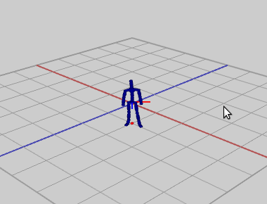

include::header.adoc[]

:title: Assignment 11: Steering and crowds
:Author Initials: ASN
:Date:    2020-02-07
:Revision: 0.1
:Dir: assignments/a11-motion
:stem: latexmath

= {title}

_In which, we implement a steering algorithm and crowd behaviors_

**Due Thursday, Dec 9, before midnight**
     
The goal of this lab is to 

* Implement a physics-based steering model for our character 
* Implement a variety of boid behaviors

video::Labs/crowds-2021.mp4[]

= Get the source

On Github, do a `Fetch Upstream` to synchronize your forked repository with the class repository.

Then update the source on your local machine and rebuild.

[source]
----
> git pull
> cd build
> cmake ..; make
----

[discrete]
== User interface overview

The camera can be controlled with the mouse:

* Left-button drag with the mouse to rotate
* Right-button drag with the mouse to pan
* Middle-button drag with the mouse to zoom
* space button will reset the view and demo

Control-left click will set the position of the target (red dot)

[discrete]
== Code overview

The code for this assignment includes the class `ASteerable`, which implements a 
steerable character, and the class `ABehavior`, which implements various steering behaviors.
Subclasses of `ABehavior` compute desired velocities which are 'fed' to the steering 
algorithm in `ASteerable`. You can control how a character moves by changing its behavior.

:sectnums:

= Steering

In the files, `behaviors-basecode.cpp` and `steerable-basecode.cpp`, implement the steering model from class. 

To run from the build directory, do the following

[source]
----
> ../bin/a11-steering
----

We will build up our steering model in steps. 

[discrete]
== Step 1: Implement a simple seek behavior with basic steering model

Implement `ASeek::computeDesiredVelocity`. 
This method should return a desired velocity (with speed MaxSpeed) which points toward the given target.

You should also set default values for "MaxSpeed" and "AgentRadius" in ABehavior's constructor. 
You may need to tweak this parameter to produce nice looking results with your steering algorithm.

[discrete]
== Step 2: Implement the steering algorithm

Compute `_vd` and `_thetad` in `ASteerable::senseControlAct`. 
Given a desired velocity and dt, `senseControlAct` computes a global translation and rotation 
and stores them in the member variable `atk::Transform _characterRoot`. 

Note: above that although in class, the vehicle has X forward (and rotates around Z), 
note that in your basecode *Z is forward (and we rotate around Y)*.

Your application should look like this

Importantly, to get nice movement, we need to tweak the gains: 

* `ASteerable::kVelKp`, 
* `ASteerable::kOriKp`, and 
* `ASteerable::kOriKv`.

One approach is to tweak these values manually. First, make large changes to find a 
good magnitude for your parameter. Then make smaller changes to fine-tune. Also, change 
parameters systematically, one at a time.

However, our orientation controller is an example of *proportional derivative* 
control, which has well-understood properties. Specifically, recall that our dynamics 
equation is 

[stem]
++++
\tau = I(k_{P} (\theta_d - \theta) - k_V \dot{\theta}) 
++++

We first solve for stem:[\tau]. Then we compute a new angular acceleration with 
stem:[\ddot{\theta} = \tau/I]. The angular acceleration is then used to turn our 
vehicle. The constants stem:[k_P, k_V] for this type of controller can be defined 
in terms of two parameters stem:[w_n] and  stem:[\zeta] like so

[stem]
++++
k_P = (w_n)^2 \\
k_V = 2 \zeta w_n
++++

stem:[w_n] is called the natural frequency and stem[\zeta] is called the damping ratio.
The rate of convergence follows the function stem:[e^{-\zeta w_n t}], so this function will 
be close to zero when stem:[\zeta w_n t = 4]. We can use this to choose stem:[\zeta] and 
stem:[w_n] so that we converge at an approximate time. 

Furthermore, the choice stem:[\zeta] will determine if the system is 
underdamped (e.g. oscillates), critically-damped (smoothly goes to stem:[\theta_d]), 
or over-damped. Specifically,

* *Underdamped* stem:[0 \leq \zeta < 1]. In the example below, we have 
stem:[w_n = 8, \zeta = 0.25]. This choice of values results in stem:[k_V = 4, k_P = 64]

image::Labs/oscillate.gif[]

* *Critically damped* stem:[\zeta = 1]. In the example below, we have stem:[w_n = 8, \zeta = 1]. 
This choice of values results in stem:[k_V = 16, k_P = 64]

image::Labs/cdamped.gif[]

* *Overdamped* stem:[\zeta > 1].  In the example below, we stem:[w_n = 8, \zeta = 2]. 
This choice of values results in stem:[k_V = 32, k_P = 64]

image::Labs/overdamped.gif[]

[discrete]
== Step3: Compute values for the gains `kOriKp` and `kOriKv` such that the character's turning is critically damped and converges in approximately 0.5 seconds.

Tip: You may find that if the character sits a while, it accumulates movement. 
You can fix this by either adding a special case to not update when the character is 
close to the goal, or by implementing a more sophisticated behavior which returns 
a desired velocity of zero when within a threshold of the goal.

= Behaviors

In `behaviors-basecode.cpp`, implement four additional behaviors of your choice.

To run from the build directory, do the following

[source]
----
> ../bin/a11-behaviors
----

*Option 1* Implement individual behaviors such as 
flee, avoid obstacles, arrive, depart, and wander. Or even create your own!
Be sure to document any new behaviors you create in your readme.

*Option 2* Implement a crowd. Extend the basecode to create N 
characters and implement alignment, cohesion, separation, leader. 

= Unique

Personalize the behaviors demo from this assignment. Here are some ideas:

* Make your crowd look heterogeneous (in `Steerable::randomizeAppearance`) by 
** randomizing the colors
** randomizing the sizes
** randomizing the animation time so that motions are no longer synchronized
* Improve the animation of the characters.  Implement a walk controller which blends between walking and standing based on the character's speed. When the speed is zero, the character should idle. When it is walking at the max speed, it should be walking.
* Animate crowds with different types of characters, such as butterflies or stampeding elephants.
* Implement crowds with different-sized characters, such as large ogres mixed with small goblins.

include::handin.adoc[]