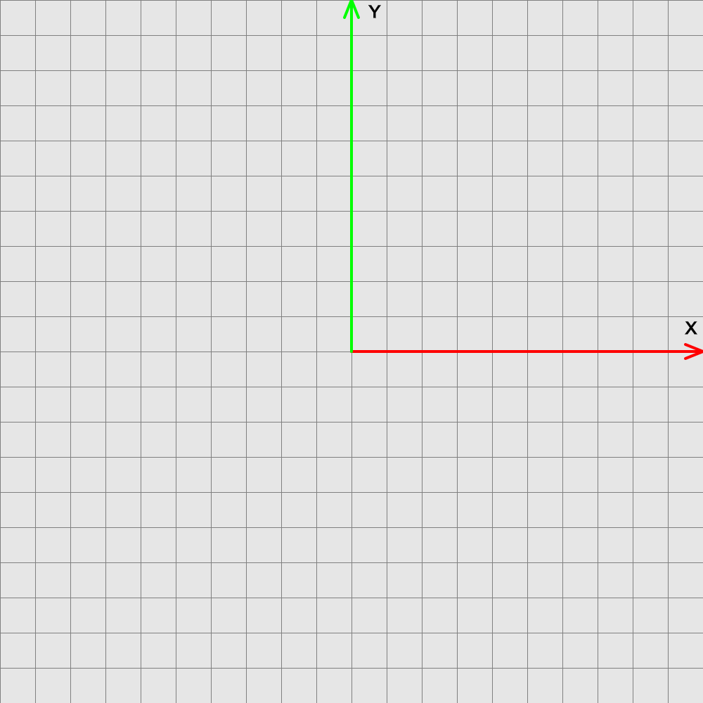

include::header.adoc[]

:title: Animation Pre-requisites: Self-assessment
:Author Initials: ASN
:Date:    2020-02-07
:Revision: 0.1
:stem: latexmath

= {title}

Use the questions below to identify topics for review.

= Trigonometry \anchor:trig[]

Consider the point *p* and angle stem:[\theta] below, where *p* is a distance of 1 unit from the origin and 
stem:[\theta] is 45 degrees. What is the coordinate of *p*? Hint: what are the values of a and b?

image:trig-ex1.png[width=200]

Consider the point stem:[p_1] and angle stem:[\theta_1] below. Suppose stem:[p_1=(2,2,0)^T]. What is the value of stem:[\theta_1]? Hint: Use tangent. 

image:trig-ex2.png[width=200]

Consider the point stem:[p_2] and angle stem:[\theta_2] above. Suppose stem:[p_2=(3,-2,0)^T]. What is the value of stem:[\theta_2]? Hint: Use tangent. 

= Vectors anchor:vector[]

A *vector* is an n-tuple of real numbers. In this class, we will work with 2D, 3D, and 4D vectors.
Suppose we have a vector *u*=(-2, 3, 0)^T^ and *v*=(-1, 4, 0)^T^. 

* Draw the vectors *u* and *v*, with their tails anchored at the origin below.

* What is the length of *u*?
* What is the distance between *u* and *v*?
* Compute and draw *u + v*.

* Compute and draw *u - v*

* Compute the cross product stem:[u \times v]. 

* Normalize the vector *u*, e.g. compute stem:[\frac{u}{\|u\|}]. 

* Compute the dot product stem:[u \cdot v]. 

= Matrices anchor:matrix[]

Consider the following matrices

[stem]
++++
A=\begin{bmatrix}
1 & 3 \\
-0.5 & 2 
\end{bmatrix}, \quad
B = \begin{bmatrix}
-3 & 0 \\
1 & 2 
\end{bmatrix}, \quad
C = \begin{bmatrix}
1 & 3 \\
-4 & 5 \\
3 & -7 
\end{bmatrix}
++++

* What are the dimensions of A, B, and C?
* What is the transpose of the matric C?
* Compute the products AB and BA.  
* Is it possible to multiply C times itself? Why not? What about CC^T^? 
* What is the product of stem:[AA^{-1}]?

Consider the following matrix

[stem]
++++
R = \begin{bmatrix}
cos(30) & sin(30) & 0\\
-sin(30) & cos(30) & 0\\
0 & 0 & 1 
\end{bmatrix}
++++

* Suppose we have a vector *u*=(1,0,0)^T^. Draw *u* below. Then multiple *u* by *R* and draw *Ru*.

= Polynomials anchor:poly[]

Consider the polynomial stem:[p(t) = 9t^3 + 6t^2]. 

* What is the degree of stem:[p(t)]? 
* What is the derivative of stem:[p(t)]?
* What is the value of stem:[p(t)] when t = -1?

Let stem:[B_0(t) = (t - 1)^2] and stem:[B_1 = t - 2]. 

* Compute an expression for stem:[p(t) = B_0(t) + B_1(t)] and re-arrange the terms into standard form

NOTE: Standard form has the following pattern: stem:[a_nt^n + \ldots + a_2 t^2 + a t + a_0].